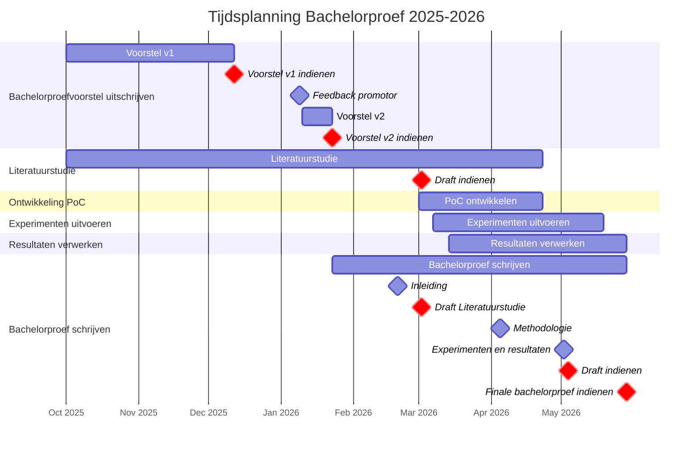
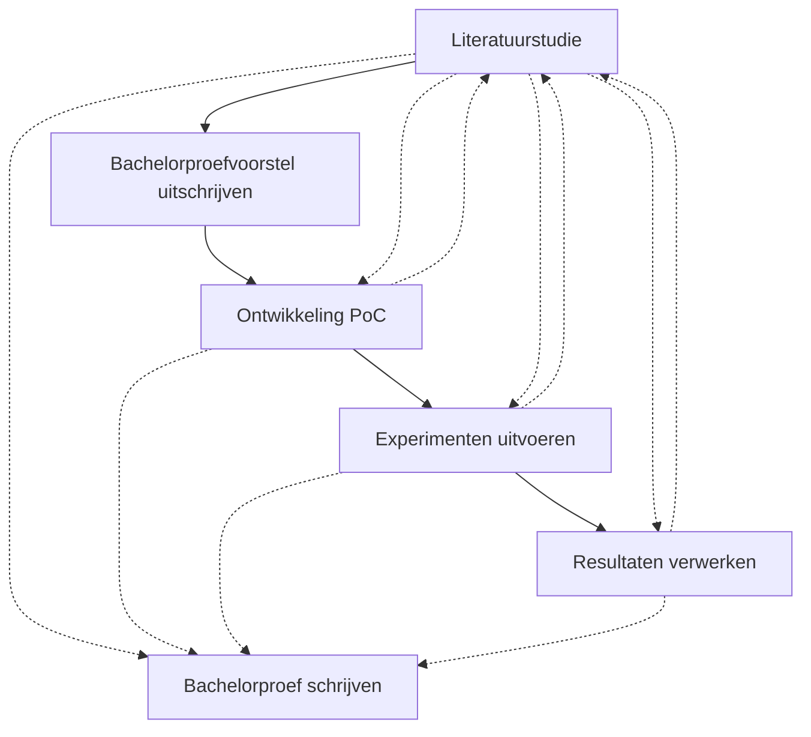

# Gantt-chart

```mermaid
---
config:
  theme: default
---
gantt
    title Tijdsplanning Bachelorproef 2025-2026
    dateFormat  YYYY-MM-DD
    axisFormat  %b %Y

    section Bachelorproefvoorstel uitschrijven
        Voorstel v1          :v1, 2025-10-01, 2025-12-12
        Voorstel v1 indienen :crit, milestone, 2025-12-12, 0d
        Feedback promotor    :milestone, 2026-01-09, 0d
        Voorstel v2          :v2, 2026-01-10, 2026-01-23
        Voorstel v2 indienen :crit, milestone, 2026-01-23, 0d

    section Literatuurstudie
        Literatuurstudie :l, 2025-10-01, 2026-04-23
        Draft indienen   :crit, milestone, 2026-03-02, 0d

    section Ontwikkeling PoC
        PoC ontwikkelen :p, 2026-03-01, 2026-04-23

    section Experimenten uitvoeren
        Experimenten uitvoeren :e, 2026-03-07, 2026-05-19

    section Resultaten verwerken
        Resultaten verwerken :r, 2026-03-14, 2026-05-29

    section Bachelorproef schrijven
        Bachelorproef schrijven       :bp, 2026-01-23, 2026-05-29
        Inleiding                     :milestone, 2026-02-20, 0d
        Draft Literatuurstudie        :crit, milestone, 2026-03-02, 0d
        Methodologie                  :milestone, 2026-04-05, 0d
        Experimenten en resultaten    :milestone, 2026-05-02, 0d
        Draft indienen                :crit, milestone, 2026-05-04, 0d
        Finale bachelorproef indienen :crit, milestone, 2026-05-29, 0d
```

# Flowchart

```mermaid
---
config:
  theme: default
---
flowchart TB
    A["Literatuurstudie"]
    B["Bachelorproefvoorstel uitschrijven"]
    C["Ontwikkeling PoC"]
    D["Experimenten uitvoeren"]
    E["Resultaten verwerken"]
    F["Bachelorproef schrijven"]

    A --> B
    B --> C
    C --> D
    D --> E

    A -.-> C & D & E
    C -.-> A
    D -.-> A
    E -.-> A

    A & C & D & E -.-> F
```
